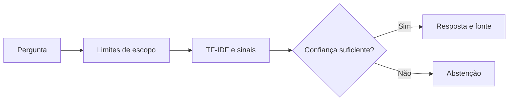

# 🔎 Lupa — assistente para entender um case de fraude

**Lupa** é um assistente de estudo que responde perguntas sobre a análise de fraudes em cartões de crédito criada neste portfólio. Ele ajuda estudantes e pessoas de áreas de dados a interpretar desbalanceamento, recall, precisão, limiar de decisão, modelos e SHAP com base em **13 verbetes revisados**. Quando a informação não está na base ou a pergunta exige dados de uma compra real, o assistente se abstém.

> **Escopo técnico:** este protótipo usa recuperação de informações com NLP clássico (**TF-IDF** de palavras e caracteres, mais sinais de domínio) e respostas previamente revisadas. **Não usa LLM generativo, não acessa contas e não avalia transações reais.** Roda localmente sem chave de API. Essa escolha torna cada resposta factual rastreável a um verbete, mas limita a compreensão de perguntas muito diferentes das previstas.

## Demonstração rápida

| Pergunta | Comportamento esperado |
| --- | --- |
| Por que 99,8% de acurácia pode ser ruim? | Explica a regra “sempre normal”, o recall zero e mostra `[CASE-02]`. |
| Quantas fraudes o XGBoost encontrou no teste? | Informa 85 de 98, recall 86,73%, e mostra `[CASE-03]`. |
| Minha compra de R$ 980 é fraude? | Explica que não há dados para classificar uma compra específica. |

O conhecimento vem dos resultados **executados** do projeto anterior de detecção de fraude: 284.807 transações, 492 fraudes e XGBoost selecionado na validação. A origem pública do conjunto é documentada no [tutorial do TensorFlow](https://www.tensorflow.org/tutorials/structured_data/imbalanced_data). Este repositório contém apenas fatos resumidos e exemplos de perguntas; **não inclui o CSV de transações**.

## Iniciar a aplicação

Requer Python 3.12. Na pasta raiz do projeto:

```bash
python -m venv .venv
# Linux/macOS: source .venv/bin/activate
# Windows: .venv\Scripts\activate
python -m pip install -r requirements.txt
python -m streamlit run src/app.py
```

Abra o endereço local mostrado no terminal. A primeira execução constrói um índice pequeno a partir dos arquivos JSON em `data/`. Para conversar no terminal, use `python -m src.assistant`.

Para repetir a avaliação:

```bash
python -m evaluation.evaluate --dataset questions
python -m evaluation.evaluate --dataset holdout
python -m evaluation.evaluate --dataset challenge
```

Os comandos reescrevem apenas os respectivos arquivos `evaluation/results_*.json`. Não são necessárias credenciais, downloads de modelos ou serviço externo durante a execução do assistente.

Para verificar também o fluxo da interface sem abrir um navegador: `python -m evaluation.smoke_ui`.

## Os seis passos do desafio

| Passo | O que foi entregue |
| --- | --- |
| 1. Documentação | [Persona, escopo, fluxo e limites](docs/01-documentacao-agente.md). |
| 2. Base de conhecimento | [Origem e esquema](docs/02-base-conhecimento.md), [13 verbetes](data/knowledge.json) e [fatos conferíveis do case](data/fontes-do-case.md). |
| 3. Prompts | [Instruções operacionais e exemplos](docs/03-prompts.md), efetivamente usadas em [política de resposta](data/response_policy.json) e [sinais de domínio](data/intent_signals.json). |
| 4. Aplicação funcional | [Chat Streamlit](src/app.py) e [motor de respostas](src/assistant.py); também há CLI. |
| 5. Avaliação | [Metodologia e limites](docs/04-metricas.md), [perguntas](evaluation/questions.json), [segunda bateria](evaluation/holdout.json), [terceira bateria](evaluation/challenge.json), [teste da interface](evaluation/smoke_ui.py) e resultados salvos. |
| 6. Pitch | [Roteiro de três minutos](docs/05-pitch.md). |

## Como funciona



As perguntas exemplificativas dos verbetes são vetorizadas em palavras e em grupos de caracteres. O código recupera a resposta de maior pontuação, acrescenta sinais de domínio transparentes e aplica limiares de confiança e ambiguidade. Ele só exibe o texto de um verbete aprovado, com um próximo passo e o identificador da fonte. Solicitações de dados não existentes ou pessoais são recusadas antes da busca. Nenhuma conversa é gravada em arquivo; o histórico visível permanece na sessão do navegador enquanto a aplicação está aberta.

## Avaliação observada

Foram registradas **74 perguntas rotuladas** em três arquivos: **52 perguntas sobre verbetes** e **22 perguntas que exigiam abstenção**. Na versão entregue, o roteiro de regressão alcança **52/52 associações de verbete**, **22/22 abstenções** e **52/52 respostas acompanhadas da referência interna**. Esses casos foram examinados durante a construção e usados para corrigir falhas; os resultados verificam os **exemplos incluídos**, sem estimar precisão em perguntas novas ou qualidade factual por julgamento independente. O [relatório de avaliação](docs/04-metricas.md) registra uma bateria que inicialmente falhou e motivou mudanças.

Arquivos de resultados: [questions](evaluation/results_questions.json), [holdout](evaluation/results_holdout.json) e [challenge](evaluation/results_challenge.json).

## Relação com o repositório base

O projeto foi criado do zero seguindo os [seis passos do Lab da DIO](https://github.com/digitalinnovationone/dio-lab-bia-do-futuro), com um tema diferente do exemplo financeiro genérico. A base foi adaptada para explicar um **case de fraude executado**, com referências locais por verbete, respostas curtas e recusa explícita de perguntas sem evidência. O mecanismo é recuperador/extrativo, conforme indicado acima; a proposta de integração com LLM do material base é uma sugestão para uma evolução futura, e não uma funcionalidade declarada nesta versão.

## Limites e evolução

- A base é pequena e fixa; perguntas novas podem ser roteadas incorretamente apesar dos exemplos de avaliação.
- Os sinais e limiares foram ajustados com as perguntas documentadas. Uma avaliação futura precisa usar perguntas de pessoas que não participaram do desenvolvimento e revisão humana das respostas.
- Se os números do projeto de fraude mudarem, é necessário revisar `data/fontes-do-case.md` e `data/knowledge.json`, depois repetir a avaliação.
- Uma próxima versão pode acrescentar busca semântica multilíngue ou geração com LLM condicionada às fontes, com testes para respostas não sustentadas.

Este assistente é **educacional** e não decide se uma transação individual deve ser bloqueada.
