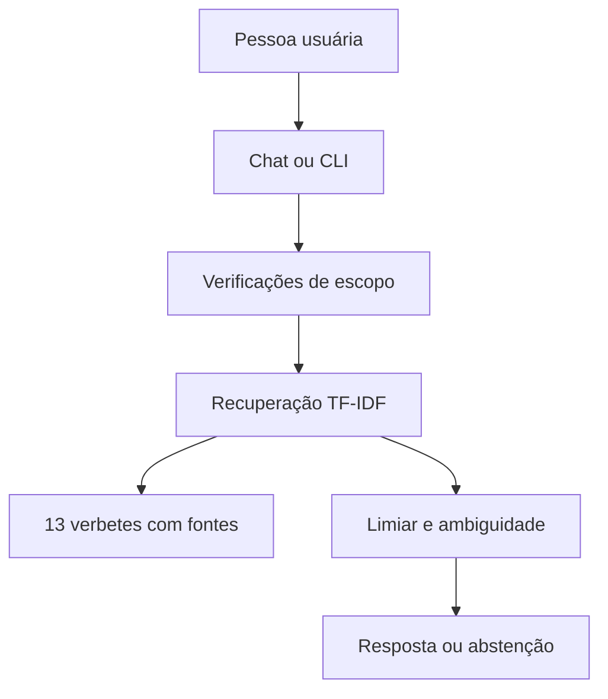

# 1. Documentação do agente

## Caso de uso

Quem vê a acurácia de 99,8% de um modelo antifraude pode concluir que ele funciona sem perceber que todas as fraudes podem ter sido ignoradas. **Lupa** ajuda estudantes e pessoas iniciantes em ciência de dados a entenderem métricas, decisões de modelagem e limites de um case específico de fraude em cartões de crédito.

**Público:** estudantes de dados, finanças e ciências atuariais que querem interpretar o experimento. **Tarefa:** responder uma dúvida por vez usando a base revisada. **Valor:** entregar explicação curta com número, fonte e próximo passo quando o projeto tem evidência suficiente.

## Persona e linguagem

Lupa é direto, didático e cauteloso. Evita jargão sem definição. Distingue o conjunto de teste de uma situação operacional real. Exemplo de abertura: “Pergunte sobre as métricas, o limiar ou o SHAP do case.” Exemplo de limite: “Não consigo classificar uma compra específica com esta base.”

## Arquitetura

O índice pequeno é criado ao iniciar o motor e reutilizado no Streamlit. As perguntas exemplificativas são vetorizadas por palavras e caracteres. Expressões de domínio, escritas em `data/intent_signals.json`, ajudam a identificar assuntos equivalentes. A resposta é o texto aprovado em `data/knowledge.json`, com o endereço da fonte interna; ela não é gerada por LLM. O estado de conversa do Streamlit é usado apenas para mostrar mensagens no navegador durante a sessão.

## Regras de confiança

1. Recusar perguntas vazias, maiores que 500 caracteres, tentativas de sobrepor instruções, solicitações de dados pessoais ou de uma compra real e entidades sabidamente ausentes.
2. Pedir especificação se duas áreas tiverem pontuações muito próximas; abster-se se a melhor pontuação não atingir o limiar.
3. Mostrar apenas uma resposta revisada, seu identificador de fonte e uma indicação de próximo passo; não criar uma estatística inédita nem uma recomendação financeira individual.
4. Revisar manualmente a base quando o projeto de origem mudar. Um link de fonte interna indica de onde o dado veio, mas não comprova automaticamente que a resposta corresponde à intenção da pergunta.

## Limitações

São 13 verbetes, uma coleção de paráfrases e sinais de domínio. O sistema pode confundir assuntos, principalmente em perguntas com vários pedidos ou novos sinônimos. Não acessa banco, serviço de cartão, dados de cliente, dataset CSV, internet ou modelo gerativo durante o uso. Não fornece decisão operacional sobre fraude.
